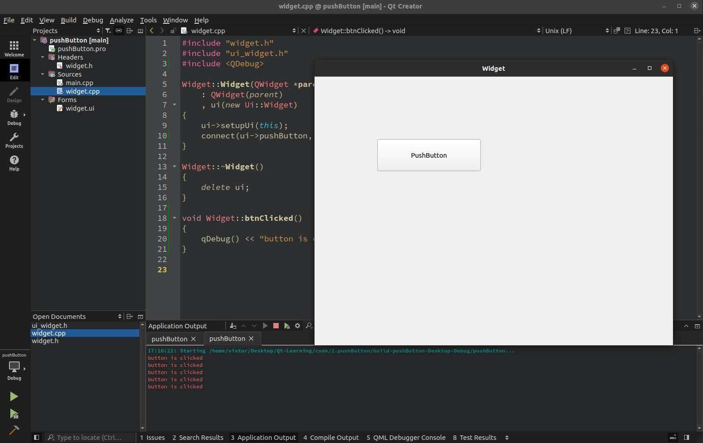
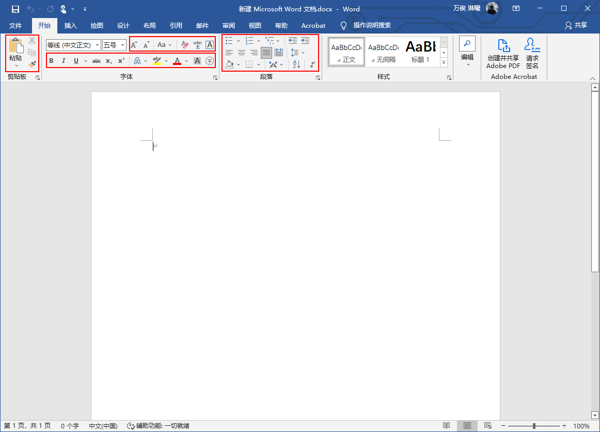
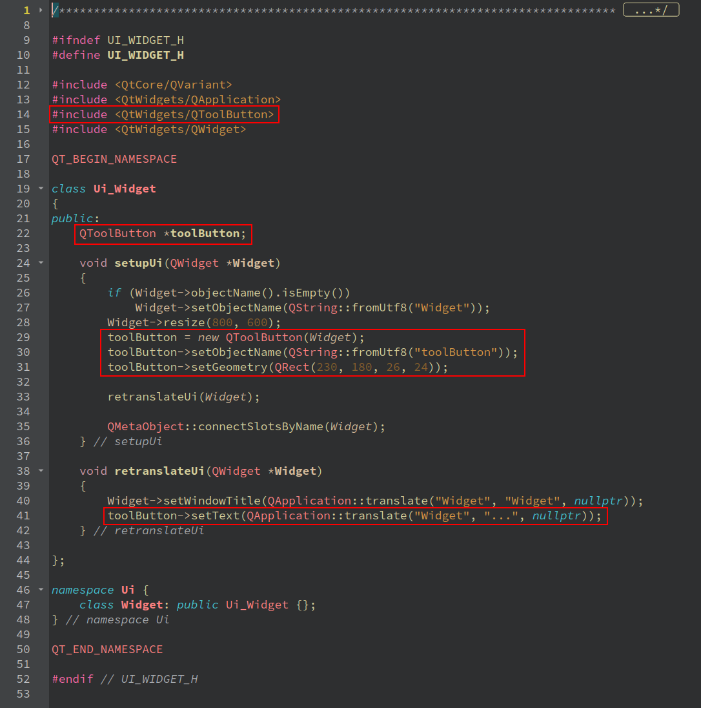
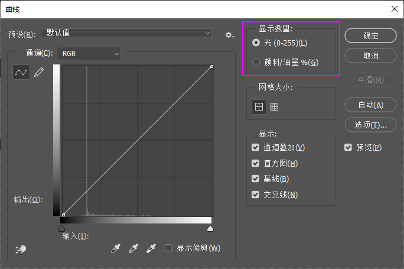
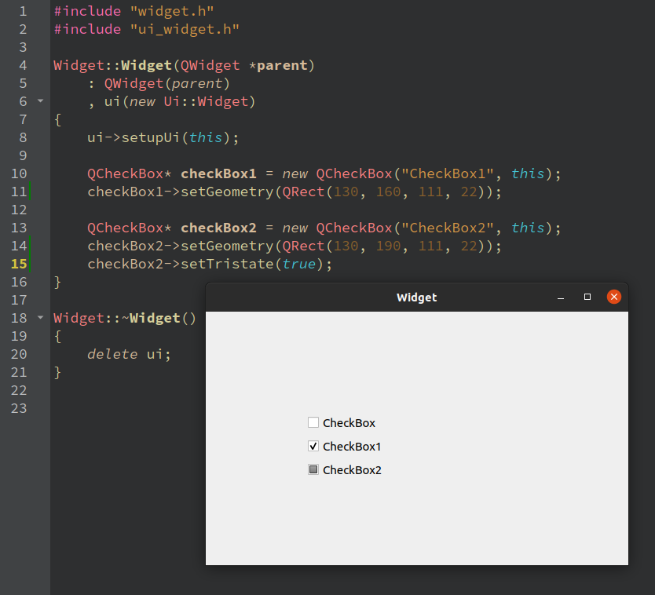

# 一、开始的开始

## 1.1 安装软件


## 1.2 新建工程-HelloWorld

万事开头 hello world，Qt 的 hello world 就是创建一个项目并运行显示窗口。

使用 Qt Creator 4.11.0，新版本可能界面不一样，但流程大同小异。

打开 Qt Creator，默认界面如下：


点击 Projects 中的 New 新建一个项目：


这里选择项目模板，左边一栏第一个是 Application（应用），中间一栏是对 Application 项目的细分，右边是各项目模板的介绍，可以根据介绍具体了解。
我们选择 Application 中的 Qt Widgets Application，创建一个桌面窗口应用，然后点击 右下角的 `Choose...`


这里设置项目名称和路径，有两点需要注意：

1. **项目名称不能有空格和中文**
   	01 Qt第一天  ——>  错误的，有空格和中文
   	01_Qt_the First Day  ——>  错误的，有空格
   	01_HelloWorld  ——>  正确的
2. **路径不能有中文**
   	/home/vistar/桌面/Qt ——> 错误的，有中文
   	/home/vistar/desktop/Qt ——> 正确的
   	/home/vistar/desktop/Qt/1. helloWorld ——> 正确的

然后下一步：


选择 build system，有qmake、CMake 和 Qbs 三个选项。
CMake 很常用，功能也很强大，许多知名的项目都是用它，比如 OpenCV 和 VTK，但它的语法繁杂。
qmake 是针对辅助 Qt 开发的，但也可以在非 Qt 项目使用，特点是语法简单明了，但功能也相对简单。
Qbs 号称下一代构建工具，也有好多人力捧 Qbs，没用过。
这里选择默认的 qmake，下一步：


这里设置类信息，首先Class name是自定义的，而且下面的Header file、Source file和From file的名称会根据自定义的Class name自动填充。
然后是Base class（基类），有三个基类供选择，QMainWindow、QWidget 和 QDialog，QMainWindow 和 QDialog 是 QWidget 的两个派生类，可以理解为都是窗口，但窗口样式不同。


QMainWindow 是主窗口，可以理解为应用程序打开后的第一个窗口（主界面），类似这样：


QWidget 是空窗口，类似这样：


QDialog 是对话框窗口，没有最小化按钮，类似这样：


这里选择 QWidget，其中 Generate form 复选框是否使用UI设计功能，如果使用，可以通过拖拽控件来设计UI界面，如果不选，则使用纯代码编辑界面，初学建议选择，下一步。


这里可以为你的项目创建一个翻译文件，将你的应用界面翻译成其他语言，初学先不管，默认none就好，下一步：


选择编译套件，如有多个，按你需要的选择，下一步：


添加版本控制系统，如不使用，默认 None 即可，同时汇总了要创建的文件和路径，可以检查是否有误，点击完成。

进入到代码编辑界面：


点击左下角的绿色小三角（或使用快捷键Ctrl + R)编译运行程序。
出现空白窗口，Qt Hello World 就完成了。


## 1.3 认识工程与软件

### 1.3.1 认识工程

新建的工程目录有如下几个文件：


QtCreator软件将他们做了如下分组，包含三个文件夹和一个.pro文件：


他们的作用分别为：

-   .pro文件：项目文件，定义项目相关信息，是`qmake`用来生成`makefile`文件的中间文件；
-   .pro.user文件：定义与用户相关的项目信息；
-   /Headers文件夹：存放头文件；
-   /Sources文件夹：存放源文件；
-   /Forms文件夹：存放ui文件；


#### 1.3.1.1 .pro文件内容解释

新建简单Qt工程，默认生成的 .pro文件内容如下，解释见注释：

```cmake
# [QT+= ]语法，定义该工程包含的Qt模块
QT       += core gui
# 由于Qt5将widgets模块从gui模块独立出来了，所以定义Qt主版本大于4就要包含widgets模块
greaterThan(QT_MAJOR_VERSION, 4): QT += widgets

# 编译宏，使用c++17编译
CONFIG += c++17
# 也可以 CONFIG -=
# CONFIG -= debug 不编译debug类型

# You can make your code fail to compile if it uses deprecated APIs.
# In order to do so, uncomment the following line.
# DEFINES += QT_DISABLE_DEPRECATED_BEFORE=0x060000    # disables all the APIs deprecated before Qt 6.0.0

# 需要编译的源文件路径（项目根目录的相对路径）
SOURCES += \
    main.cpp \
    widget.cpp

# 需要编译的头文件路径（项目根目录的相对路径）
HEADERS += \
    widget.h

# 需要编译的ui文件路径（项目根目录的相对路径）
FORMS += \
    widget.ui

# 只知道是设置目标可以执行文件路径的，具体语法看不懂，如果你知道欢迎评论区留言
# Default rules for deployment.
qnx: target.path = /tmp/$${TARGET}/bin
else: unix:!android: target.path = /opt/$${TARGET}/bin
!isEmpty(target.path): INSTALLS += target
```


除工程默认的一些字段，.pro文件还有一些其他字段：

```cmake
# 目标可执行文件的名称，不指定默认为工程名
TARGET = exe_name

# 目标可执行文件的存放目录，不指定默认为realse目录
# 几个指定目录的符号：
# 宏 $$PWD 代表当前目录和 ./ 等效
# ../ 代表上一级目录
DESTDIR = exe_dir

# 编译宏开关，根据不同宏作不同的编译
DEFINES += defines

# obj文件目录，即 .o 文件
OBJECTS_DIR = obj_dir

# 资源文件路径，包括图片、音频等（项目根目录的相对路径）
RESOURCES += res.rc

# 链接库路径（项目根目录的相对路径）
DEPENDPATH += depend_dir

# 链接库文件（项目根目录的相对路径）
LIBS += -Llib_name
# 也可以直接写带路径的链接库文件
LIBS += -Llib_dir_name

# 引用库头文件路径（项目根目录的相对路径）
INCLUDES += include_dir

# 项目使用的模板类型
TEMPLATE = app
TEMPLATE = lib
```


#### 1.3.1.2 其他文件内容解释


#### 1.3.1.2 资源文件介绍与使用

Qt工程分组中，除了`Headers`、`Sources`、`Forms`外，还有一个文件夹`Resources`，只有当工程中有图片、音频等资源文件时才会用到。

首先将资源文件存放到工程目录下的文件夹中，然后添加`.qrc`文件，方法如下：

在工程目录右键-->选择`Add New` 


选择Qt-->Qt Resource File，然后点击Choose...


然后可以自定义文件名和路径，点击Next>


然后可以选择要添加到的工程和使用的版本控制工具，这里默认，然后点击Finish


然后，工程目录中就会出现`Resources`目录和`res.qrc`文件，点击`Add Prefix`添加前缀


Qt通过前缀对资源文件分类，如有需要用户可以自定义前缀名称，如不需要分类可以修改前缀为`/`，然后点击`Add Files`添加资源文件


找到工程目录下的资源文件位置，全选导入，再构建一下（点右下角那个小锤子），就可以在`Resources`目录下看到这些文件了，如下图：


其中`.qrc`文件存储的是资源文件的相对路径，`.qrc`文件格式如下：

```xml
<RCC>
    <qresource prefix="/">
        <file>res/742c.png</file>
        <file>res/20220918143827.png</file>
        <file>res/Einstein.png</file>
        <file>res/icon.png</file>
    </qresource>
</RCC>
```

使用资源文件时输入的路径格式为`“:/res/icon.png”`，其中`:`后面是前缀+文件相对路径，比如为按钮添加背景图片：

```c++
toolBtn->setIcon(QIcon(":/res/icon.png"));
```

如果需要对资源文件进行分类，上面点击`Add Prefix`添加前缀那一步，可以填写自定义的前缀名称，点击一次`Add Prefix`添加一个前缀（分类），然后把对应的文件添加进去，再构建一下就可以了。


其中`.qrc`文件内容如下：

```xml
<RCC>
    <qresource prefix="/first">
        <file>res/742c.png</file>
        <file>res/20220918143827.png</file>
    </qresource>
    <qresource prefix="/second">
        <file>res/Einstein.png</file>
        <file>res/icon.png</file>
    </qresource>
</RCC>
```

这时`icon.png`文件的路径就变为`:/second/res/icon.png`了。


**小建议**

获取文件路径，建议在`Resources`目录下对应的资源文件上右键，选择`Copy Path`复制：


### 1.3.2 认识Qt Creator

打开Qt Creator默认界面如下


其中，

1.   Qt Creator工作模式选择；
2.   构建套件选择；
3.   构建并运行程序；
4.   调试程序；
5.   构建程序；
6.   搜索项目、文件、类、函数、文档和文件系统，输入数字n，可以跳转到当前文件的第n行；
7.   任务栏，显示运行、调试或构建程序时的输出。


#### 1.3.2.1 模式选择


从上往下各模式依次为：欢迎模式、编辑模式、设计模式、调试模式、项目模式、帮助模式，第一次打开Qt Creator默认选择欢迎模式，欢迎模式中默认选择项目（Projects）。


##### 欢迎模式


其中，

1.   创建新项目，创建流程介绍见：[Qt 学习(二) —— 创建项目及注意事项](https://blog.csdn.net/maizousidemao/article/details/104152353)
2.   打开已有项目
3.   帮助，跳转到帮助模式
4.   项目，即右侧当前页5、6
5.   最近打开的会话
6.   最近打开的项目
7.   官方示例项目
8.   官方教程，需要YouTube播放
9.   Qt商店，可以安装Qt扩展，有些需要付费
10.   下载Qt安装程序
11.   创建或管理Qt账户
12.   Qt在线社区
13.   Qt官方博客
14.   用户手册，跳转到帮助模式


##### 编辑模式


其中，

1.   显示内容，有如下选择：


分别为：项目(Project)、打开的文件(Open Documents)、书签(Bookmarks)、文件系统(File System)、类视图(Class View)、Git分支(Git Branches)、当前文件的函数概要(Outline)、测试(Tests)、类层次结构(Type Hierarchy)、头文件层次结构(Include Hierarchy)

2.   对项目树的显示作进一步设置，可以打开、关闭或简化显示的项目文件树。
3.   是否与右侧编辑器同步选择文件。
4.   添加更多显示栏，用于显示1中的内容。
5.   关闭当前显示栏。
6.   显示当前已打开的文件列表。
7.   可快速将光标跳转到当前文件的函数或变量的行首，右键可以选择是否按字母排序。
8.   设置当前文件的换行符。
9.   设置文件静态检查。
10.   执行文件静态检查。
11.   显示光标所在行列位置。
12.   编辑器分栏。
13.   更多显示栏，同1。
14.   显示编译文件时的编译警告或错误。
15.   清空错误和警告。
16.   选择编译警告和错误。
17.   关闭显示编译警告。


##### 设计模式

如果没有打开ui文件，设计模式默认不能用，打开ui文件，界面会自动跳转到设计模式：


其中，

1.   控件区：包含一些常用的ui控件；
2.   编辑区：用于设计ui界面，可以将1中的控件拖到此区域；
3.   对象查看区：可以查看控件对象的父子关系及一些简单信息；
4.   动作、信号、槽编译区：可以编辑指定动作及相应控件的信号与槽；
5.   控件属性编译区：编辑指定控件的属性，会按继承关系展示所选控件的各属性；


##### 调试模式


调试代码运行过程中的数据等，细节待补。


##### 项目模式


配置项目相关的构建运行、编辑器、代码风格、依赖关系等。


##### 帮助模式


在右上角的显示内容里默认显示目录(Contents)，还可以选择书签(Bookmarks)、索引(Index)、搜索(Search)等。

如果选择搜索，可以查找Qt相关函数、类、枚举等的解释。


#### 1.3.2.2 构建套件选择


包括Debug、Profile、Release，他们的区别如下：

|  配置   |                    描述                    |
| :-----: | :----------------------------------------: |
|  Debug  |         带调试信息，编译时不做优化         |
| Profile |        带调试信息，编译时做一定优化        |
| Release | 不带调试信息，根据优化选项做不同程度的优化 |


### 1.3.3 qmake生成makefile过程


## 1.4 Qt 模块简介

Qt由许多模块组成，分别支持不同领域的功能，主要分为 `Essentials` 和 `Add-On`。

`Qt Essential` 是基本模块，它们可以在所有受支持的开发平台和经过测试的目标平台上使用。基本模块是通用的，适用于大多数Qt应用程序。

`Qt Add-On` 是附加模块/扩展模块，用于特殊目的开发。这些模块可能仅在某些开发平台上可用。许多附加模块要么功能完整，存在是为了向后兼容，要么仅适用于某些平台。每个附加模块分别指定其兼容性。

### 1.4.1 Qt基本模块

Qt 基本模块如下表：

|       模块        |                             描述                             |
| :---------------: | :----------------------------------------------------------: |
|      Qt Core      | 所有基于Qt的应用程序的基础，其他模块使用的核心非图形类。<br>提供信号与槽的对象通信机制、并发和多线程、容器/事件系统、插件和I/O设施。 |
|     Qt D-Bus      | D总线协议上进程间通信的类。<br>是一种进程间通信(IPC)和远程过程调用(RPC)机制，一般用于用于多对多通信。 |
|      Qt GUI       | 图形用户界面（GUI）组件的基类。<br>包括与窗⼝系统的集成、事件处理、OpenGL和OpenGL ES集成、2D图像、字体、拖放等。<br>这些类⼀般在Qt⽤户界⾯类内部使⽤，当然也可以⽤于访问底层的OpenGL ES 图像API。<br>Qt Gui模块提供的是所有图形⽤户界⾯程序都需要的通⽤功能。 |
|    Qt Network     |      提供跨平台的⽹络功能，使网络编程更容易和更可移植。      |
|      Qt QML       |                  用于QML和JavaScript语言。                   |
|     Qt Quick      | ⼀种基于 Qt 的⾼度动画的⽤户界⾯，适合于移动平台开发，用于构建具有自定义用户界面的高度动态应用程序的声明性框架。 |
| Qt Quick Controls | 提供轻量级QML类型，用于为桌面、嵌入式和移动设备创建高性能的用户界面。这些类型采用简单的样式体系结构，非常有效。 |
| Qt Quick Dialogs  |     用于从Qt快速应用程序创建系统对话框并与之交互的类型。     |
| Qt Quick Layouts  |             用于在 Qt Quick 2 中安排项目的布局。             |
|   Qt Quick Test   | QML应用程序的单元测试框架，其中测试用例以JavaScript函数的形式编写。<br>注：二进制兼容性保证不适用于 Qt 快速测试。但是，它将保持源代码兼容。 |
|      Qt Test      | 用于单元测试 Qt 应用程序和库的类。<br/>注意：二进制兼容性保证不适用于 Qt 测试。 但是，它将保持源兼容。 |
|    Qt Widgets     |                 扩展Qt GUI模块的C++窗口类 。                 |


### 1.4.2 Qt扩展模块

Qt扩展模块如下表：

|       模块        | 开发平台 |                    目标支持平台                    |                             描述                             |
| :---------------: | :------: | :------------------------------------------------: | :----------------------------------------------------------: |
|     Active Qt     | Windows  |                      Windows                       |                 用于ActiveX和COM应用程序的类                 |
|   Qt Bluetooth    |   All    | Android, iOS, Linux, Boot to Qt, macOS and Windows |                    提供对蓝牙硬件的访问。                    |
|       Qt 3D       |   All    |                        All                         |            支持2D和3D渲染的近实时仿真系统的功能。            |
|      Qt CoAP      |   All    |                        All                         |                实现RFC 7252定义的CoAP客户端。                |
|   Qt Concurrent   |   All    |                        All                         |         用于编写多线程程序而不使用低级线程原语的类。         |
|      Qt Help      |   All    |                        All                         |               用于将文档集成到应用程序中的类。               |
| Qt Image Formats  |   All    |                        All                         |        用于其他图像格式的插件：TIFF、MNG、TGA、WBMP。        |
|     Qt OpenGL     |   All    |                        All                         | 使OpenGL在Qt应用程序中易于使用的C++类。一个单独的Qt OpenGL Widgets C++类，提供了一个用于渲染OpenGL图形的窗口小部件。 |
|   Qt Multimedia   |   All    |            All (except QNX, INTEGRITY)             | 一组丰富的QML类型和C++类，用于处理多媒体内容。还包括处理摄像头访问的API。 |
| Qt Print Support  |   All    |                        All                         |                  使打印更容易和更便携的类。                  |
| Qt Quick Widgets  |   All    |                        All                         |             提供用于显示Qt快速用户界面的C++类。              |
| Qt Remote Objects |   All    |                        All                         | 提供了一种易于使用的机制，用于在进程或设备之间共享QObject的API（属性/信号/插槽）。 |
|     Qt OPC UA     |   All    |           All (except QNX, WebAssembly)            |              工业应用中数据建模和数据交换协议。              |
|     Qt SCXML      |   All    |                        All                         | 提供用于从SCXML文件创建状态机并将其嵌入应用程序的类和工具。  |
|    Qt Sensors     |   All    |             Android, iOS, and Windows              |                   提供对传感器硬件的访问。                   |
|   Qt Serial Bus   |   All    |        Linux, Boot to Qt, macOS and Windows        | 提供对串行工业总线接口的访问。目前，该模块仅支持CAN总线和Modbus协议。 |
|  Qt Serial Port   |   All    |        Linux, Boot to Qt, macOS and Windows        |              提供与硬件和虚拟串行端口交互的类。              |
|      Qt SQL       |   All    |                        All                         |                 使用SQL进行数据库集成的类。                  |
| Qt State Machine  |   All    |                        All                         |                提供用于创建和执行状态图的类。                |
|      Qt SVG       |   All    |                        All                         | 用于显示SVG文件内容的类。支持SVG1.2标准的一个子集。一个单独的Qt SVG Widgets C++类库，支持在Widgets UI中显示SVG文件。 |
|    Qt UI Tools    |   All    |                        All                         | 用于在运行时动态加载QtDesigner中创建的基于QWidget的表单的类。 |
|   Qt WebChannel   |   All    |                        All                         | 提供对来自HTML客户端的QObject或QML对象的访问，以实现Qt应用程序与HTML/JavaScript客户端的无缝集成。 |
|   Qt WebEngine    |   All    |             Windows, Linux, and macOS              | 用于在使用Chromium浏览器项目的应用程序中嵌入web内容的类和函数。 |
|   Qt WebSockets   |   All    |                        All                         |              提供符合RFC 6455的WebSocket通信。               |
|    Qt WebView     |   All    |               具有本地web引擎的平台                | 通过使用平台原生的API在QML应用程序中显示web内容，而无需包含完整的web浏览器堆栈。 |
|      Qt XML       |   All    |                        All                         |             在文档对象模型（DOM）API中处理XML。              |
|  Qt Positioning   |   All    |       Android, iOS, macOS, Linux and Windows       |            提供位置、卫星信息和区域监测类的访问。            |
|      Qt NFC       |   All    |                  Android and iOS                   |              提供对近场通信（NFC）硬件的访问。               |

以下扩展模块需要在商业许可证或GNU通用公共许可证v3下使用。

|           模块           | 开发平台 |                    目标支持平台                    |                             描述                             |
| :----------------------: | :------: | :------------------------------------------------: | :----------------------------------------------------------: |
|        Qt Charts         |   All    |                        All                         |       由静态或动态数据模型驱动的用于显示图表的UI组件。       |
|  Qt Data Visualization   |   All    |                        All                         |               用于创建三维数据可视化的UI组件。               |
|   Qt Lottie Animation    |   All    |                        All                         | 用于渲染由Adobe After Effects的Bodymovin插件以JSON格式导出的图形和动画。 |
|         Qt MQTT          |   All    |                        All                         |                   提供MQTT协议规范的实现。                   |
| Qt Network Authorization |   All    |                        All                         |             为在线服务提供基于OAuth的授权支持。              |
|   Qt Virtual Keyboard    |   All    | Linux and Windows desktop, and Boot to Qt targets. | 用于实现不同输入方法以及QML虚拟键盘的框架。支持本地化键盘布局和自定义视觉主题。 |
|       Qt Quick 3D        |   All    |                        All                         |          提供基于Qt Quick创建3D内容或UI的高级API。           |
|    Qt Quick Timeline     |   All    |                        All                         |                启用基于关键帧的动画和参数化。                |
|     Qt Shader Tools      |   All    |                        All                         | 为跨平台Qt着色器管道提供工具。这些支持处理图形和计算着色器，使其可用于Qt Quick和Qt生态系统中的其他组件。 |
|  Qt Wayland Compositor   |   All    |           Linux and Boot to Qt targets.            |                提供开发Wayland合成器的框架。                 |

以下扩展模块仍在开发中：

|  模块  | 开发平台 |        目标支持平台        |            描述             |
| :----: | :------: | :------------------------: | :-------------------------: |
| Qt PDF |   All    | Windows, Linux, and macOS. | 用于显示PDF文档的类和函数。 |


# 二、控件

## 2.1 控件组介绍


控件分8个组，分别为：

|           控件组            |              描述              |
| :-------------------------: | :----------------------------: |
|           Layouts           |   布局：控制控件在窗口的布局   |
|           Spacers           | 间隔：辅助控制控件在窗口的布局 |
|           Buttons           |       按钮：按钮相关控件       |
|  Item Views（Model-Based）  |            项目视图            |
| Item Widgets（Model-Based） |            项目组件            |
|         Containers          |    容器：可以存放控件的控件    |
|        Input Widgets        |     输入组件：输入相关控件     |
|       Display Widgets       |     显示组件：显示相关控件     |


## 2.2 按钮组件(Buttons)


|        控件         |     描述     |
| :-----------------: | :----------: |
|     Push Button     |   普通按钮   |
|     Tool Button     |   工具按钮   |
|    Radio Button     |    单选框    |
|      Check Box      |    复选框    |
| Command Link Button | 命令连接按钮 |
|  Dialog Button Box  |  对话框按钮  |


按钮各控件类的继承关系如下：


### 2.2.1 QPushButton

QPushButton按钮，是Qt常用的控件之一，提供普通的按钮功能。

通过信号槽机制接收触发信号并执行对应动作。

#### 2.2.1.1 创建QPushButton

它有三个构造函数：

```c++
// 空对象
explicit QPushButton(QWidget *parent = nullptr);
// 指定QPushButton显示的文字
explicit QPushButton(const QString &text, QWidget *parent = nullptr);
// 指定QPushButton背景图片和显示的文字
QPushButton(const QIcon& icon, const QString &text, QWidget *parent = nullptr);
```

最常用的创建方法为：`QPushButton(QWidget *parent = nullptr);` 并且把它的父对象指定为它所在的窗口对象。


#### 2.2.1.2 信号

它通过信号来接收特定的操作，信号包括：

| 信号                                | 操作           | 描述                                     |
| ----------------------------------- | -------------- | ---------------------------------------- |
| void pressed();                     | 按下按钮       | 按钮被按下会发出此信号                   |
| void released();                    | 释放按钮       | 按钮被释放（松开）会发出此信号           |
| void clicked(bool checked = false); | 点击按钮       | 按钮被点击（即按下后再释放）会发出此信号 |
| void toggled(bool checked);         | 按钮状态被切换 | 按钮状态被切换时会发出此信号             |

这些信号在`QAbstractButton`中定义，也就是说继承于`QAbstractButton`的按钮类都可以使用这些信号。

由于`QPushButton`使用最多的操作是点击触发某个行为，所以它常用的信号为`pressed`和`released`， 当然也可以使用其他信号实现一些特殊功能。


#### 2.2.1.3 使用

最常用的点击触发某个行为：

创建一个widget空窗口项目，

首先，切换到ui设计界面，拖动添加一个`Push Button`按钮，


可以在右侧修改按钮对象的名称，也可以使用默认的`pushButton`。

然后，回到widget.cpp文件，连接信号与槽，并实现槽函数(点击按钮要实现的动作)。


其中，`connect(ui->pushButton, &QPushButton::clicked, this, &Widget::btnClicked);`用于连接按钮信号与其槽函数（关于connect见[Qt 学习(四) —— 信号和槽](https://blog.csdn.net/maizousidemao/article/details/104199773)）

`void Widget::btnClicked()`是其槽函数，按键`clicked`信号触发的动作实现在这个函数里。

这里点击按钮后会在`QtCreator`的`Application OutPut`窗口打印`button is clicked`，如下图：



以上是pushbutton按钮的使用方法，可以把信号换成`pressed`或`released`试一下。


#### 2.2.1.4 按钮样式

##### 1.按钮文字

通常我们通过按钮上的文字说明按钮的功能，可以使用`setText()`函数设置按钮文字。

```c++
ui->pushButton->setText("按钮");
```

如果想获取一个按钮的文字，可以使用`text()`函数：

```c++
QString btnText = ui->pushButton->text();
```

##### 2.按钮大小

使用`setGeometry`函数可以设置按钮的大小及位置，`setGeometry`接收一个`QRect`矩形对象，用以指定按钮大小及位置，如下：

```c++
pushButton->setGeometry(QRect(140, 140, 231, 71));
```

其中前两个参数指定位置（x, y），后两个参数指定大小（height, width）。


另外还可以使用`resize`函数单独设置按钮的大小：

```c++
ui->pushButton->resize(80, 80);
```

##### 3.其他样式

其他样式主要使用`void setStyleSheet(const QString& styleSheet);` 函数设置样式表。

该函数传入`QString`类型的参数，是遵循 `qss` 语法的编码字符串。

`qss` 语法和 `css` 语法基本相同。

比如基本常用的设置按钮的背景色、按钮字体、矩形按钮圆角等。

```c++
ui->pushButton->setStyleSheet("QPushButton {"
                              "background-color: green;" // 按钮背景色
                              "font: bold 20px;"	// 按钮字体
                              "border-width: 1px;"	// 按钮边框线宽
                              "border-radius: 16px;" // 按钮边框圆角半径
                              "color: white;" 	// 按钮文字颜色
                              "}");
```

效果如下：


合理配合大小与圆角的设置，还可以画出圆形按钮：

```c++
ui->pushButton->resize(80, 80);
ui->pushButton->setStyleSheet("QPushButton {"
                              "background-color: green;" // 按钮背景色
                              "font: bold 20px;"	// 按钮字体
                              "border-width: 1px;"	// 按钮边框线宽
                              "border-radius: 40px;" // 按钮边框圆角半径
                              "color: white;"      // 按钮文字颜色
                              "}");
```

效果如下：


### 2.2.2 QToolButton

QToolButton按钮常用作工具栏的快捷工具，

比如Qt Creator右下角的构建套件选择器，就是QToolButton：


还有PhotoShop中工具栏的一些快捷工具，也是QToolButton：


更常见的office word中，也普遍使用QToolButton：



（注：以上例子不一定使用Qt开发，只是举例按钮符合QToolButton的特征。）


可以发现QToolButton常用的是显示图片，而不是像QPushButton一样显示文字；

另外有些QToolButton旁边有小箭头，点击会弹出一个子列表显示更多的功能；

还有些QToolButton的文字在图标下方，不像QPushButton文字在图标右方；

这些都是QToolButton特性，接下来逐一介绍。


#### 2.2.2.1 创建QToolButton

和QPushButton不同，QToolButton只有一个构造函数

```cpp
explicit QToolButton(QWidget *parent = nullptr);
```

当然通常也是把它的父对象指定为它所在的窗口对象。

可以使用代码创建，也可以拖拽控件创建，拖拽控件会自动生成代码。

这里我们看一下究竟生成了哪些代码：

创建一个widget空窗口项目，打开`ui_widget.h`文件（widget是你自定义的类名，总之就是打开前面带`ui_`的这个头文件，这里注意，打开之前要先编译一下工程，否则该文件没有生成，会报错），报错如下：


编译后，`ui_widget.h`文件打开如下：


然后切换到ui设计界面，拖动添加一个`Tool Button`按钮，这样就生成了一个`QToolButton`对象，到这里就可以使用这个对象了。

但我们要看一下拖拽控件生成了哪些代码，保存刚刚编辑的ui界面，然后回到代码编辑界面，再次编译（是为了更新`ui_widget.h`文件，刚刚添加的控件只是保存在了`widget.ui`文件中，相关的对象还没有创建），打开`ui_widget.h`如下：



其中，

```c++
#include <QtWidgets/QToolButton>
```

引用`QToolButton`头文件。

```c++
QToolButton *toolButton;
```

创建一个`QToolButton`对象指针。

```c++
toolButton = new QToolButton(Widget);
toolButton->setObjectName(QString::fromUtf8("toolButton"));
toolButton->setGeometry(QRect(230, 180, 26, 24));
```

实例化一个`QToolButton`对象，并设置对象名称、按钮位置和按钮大小。

```c++
toolButton->setText(QApplication::translate("Widget", "...", nullptr));
```

设置按钮文字，这里设置为`...`

其中，必要的是“`QToolButton`头文件”和“实例化`QToolButton`对象”，其余均可以按照需求自定义。

所以自己写代码使用`QToolButton`时，可以参考以下代码：

```c++
#include <QtWidgets/QToolButton>
// this是QToolButton所在窗口的指针
QToolButton* toolBtn = new QToolButton(this);
```


#### 2.2.2.2 为QToolButton添加图标

这里涉及到Qt资源，软件使用的声音文件、图片文件等，都以资源的形式加载，使用前需要为工程添加资源文件，具体添加方法见[qrc资源文件介绍与使用](https://blog.csdn.net/maizousidemao/article/details/127033800?spm=1001.2014.3001.5502)

以上述使用代码创建的`QToolButton`对象`toolBtn`为例，为了方便展示，首先给按钮设置一个合适的大小：

```c++
toolBtn->setGeometry(QRect(230, 170, 50, 50));
```

然后使用`setIcon`函数为按钮添加背景图标：

```c++
toolBtn->setIcon(QIcon(":/res/icon.png"));
// 调整背景图标大小
toolBtn->setIconSize(QSize(30, 30));
```


#### 2.2.2.3 为QToolButton添加文字

函数`setText`可以设置QToolButton的文字：

```c++
toolBtn->setText("小飞机");
```

但会发现，文字并没有显示，这是因为QToolButton有一个`toolButtonStyle`属性，可以设置文本和图片的显示方式，该属性默认只显示图标，当同时设置文字和图标时，会只显示图标不显示文字。


#### 2.2.2.4 设置按钮风格

可以通过`setToolButtonStyle(Qt::ToolButtonStyle style)`函数设置按钮风格，入参为枚举值：

```c++
enum ToolButtonStyle {
    ToolButtonIconOnly,
    ToolButtonTextOnly,
    ToolButtonTextBesideIcon,
    ToolButtonTextUnderIcon,
    ToolButtonFollowStyle
};
```

枚举值描述如下：

|           枚举常量           |  值  |               描述                |
| :--------------------------: | :--: | :-------------------------------: |
|    Qt::ToolButtonIconOnly    |  0   |            只显示图标             |
|    Qt::ToolButtonTextOnly    |  1   |            只显示文本             |
| Qt::ToolButtonTextBesideIcon |  2   |        文本显示在图标旁边         |
| Qt::ToolButtonTextUnderIcon  |  3   |        文本显示在图标下方         |
|  Qt::ToolButtonFollowStyle   |  4   | 按照QStyle::StyleHint所设置的显示 |

设置`文本显示在图标下方`：

```c++
toolBtn->setToolButtonStyle(Qt::ToolButtonTextUnderIcon);
```


#### 2.2.2.5 设置按钮扁平化

`autoRaise`属性可以控制`toolButton`的扁平化，即按钮和界面齐平，不显示按钮的边框。

可以使用`void setAutoRaise(bool enable);`函数设置`autoRaise`的值：

```c++
toolBtn->setAutoRaise(true);
```

设置后的效果如下：


#### 2.2.2.6 设置按钮菜单


### 2.2.3 QRadioButton

`QRadioButton`既单选框，常用作表单互斥选择选项，在“多选一”的场景中使用。

office word和PhotoShop中都有使用单选框，如下：





#### 2.2.3.1 创建QRadioButton

`QRadioButton`有两个构造函数，都要指定父对象，其中一个可以设置单选框的文本。

```c++
explicit QRadioButton(QWidget *parent = nullptr);
explicit QRadioButton(const QString &text, QWidget *parent = nullptr);
```

同样可以通过拖动控件创建，也可以使用代码直接创建，控件创建默认使用构造函数`QRadioButton(QWidget *parent = nullptr);`。

如下图创建了三个单选按钮，其中，`RadioButton`通过拖拽控件创建，`RadioButton1`和`RadioButton2`通过代码直接创建：


#### 2.2.3.2 修改QRadioButton文本

不仅在构造时指定按钮的文本，构造后也可以修改，使用函数`void setText(const QString &text);`


#### 2.2.3.3 QRadioButton分组

`QRadioButton`默认属于同一父组件的所有单选框都互斥，如果同一界面需要有多组“多选一”的单选按钮，可以使用`QButtonGroup`为单选框分组，则每个分组内部的按钮都默认互斥。

左右两个按钮组内的按钮分别互斥。


#### 2.2.3.4 QRadioButton的信号

`QRadioButton` 没有自己独有的信号，它继承于 `QAbstractButton` ，可以使用`pressed`、`released`、`clicked`、`toggled`等信号。

由于`QRadioButton`常用作选择按钮，需要判断选择状态，所以`toggled`信号比较常用，

对于单个按钮，使用`void toggled(bool checked);`信号可以获得该按钮的选中状态：

```c++
// 连接信号与槽函数
connect(radioButton, SIGNAL(toggled(bool)), this, SLOT(btnToggled(bool)));

// 在槽函数中根据按钮选中与否进行相应操作
void Widget::btnToggled(bool checked)
{
    if (checked)
    {
        qDebug("button is checked.");
    }
    else
    {
        qDebug("button is unchecked.");
    }
}
```


对于按钮组（一组QRadioButton按钮），每个按钮写一个槽函数不太现实（QRadioButton的信号不能返回按钮索引，不适用多个按钮的情况），需要使用按钮组`QRadioButton`的` void idToggled(int, bool);`信号，它不仅可以返回按钮id还可以返回按钮选中状态，

```c++
// 连接信号与槽函数
connect(btnGroup1, SIGNAL(idToggled(int,bool)), this, SLOT(btnToggled(int,bool)));

// 在槽函数中根据按钮选中与否进行相应操作
void Widget::btnToggled(int btn, bool checked)
{
    if (!checked)
    {
        return;
    }

    switch (btn)
    {
    case 0:
        qDebug("This is button zreo");
        break;
    case 1:
        qDebug("This is button one");
        break;
    case 2:
        qDebug("This is button two");
        break;
    default:
        break;
    }
}
```


### 2.2.4 QCheckBox

`QCheckBox`即复选框，常用作表单非互斥选择，，在“多选多”的场景中使用。

office word和PhotoShop中都有使用复选框，如下：


#### 2.2.4.1 创建QCheckBox

`QCheckBox`有两个构造函数，都要指定父对象，其中一个可以设置复选框的文本。

```c++
explicit QCheckBox(QWidget *parent = nullptr);
explicit QCheckBox(const QString &text, QWidget *parent = nullptr);
```

同样可以通过拖动控件创建，也可以使用代码直接创建，控件创建默认使用构造函数`QCheckBox(QWidget *parent = nullptr);`。

如下图创建了三个单选按钮，其中，`CheckBox`通过拖拽控件创建，`CheckBox1`和`CheckBox2`通过代码直接创建：


#### 2.2.4.2 成员函数与信号

`QCheckBox`除了继承于`QAbstractButton`的信号外，还有一个自己的信号`void stateChanged(int);`，当复选框状态改变，会发出该信号，并返回复选框的状态，其中复选框的状态有三种：

|       Constant       | Value |                 Description                  |
| :------------------: | :---: | :------------------------------------------: |
|    Qt::Unchecked     |   0   |                   未被选中                   |
| Qt::PartiallyChecked |   1   | 部分被选中，即复选框有子项且子项未被全部选中 |
|     Qt::Checked      |   2   |                    被选中                    |


`QCheckBox`的成员函数除了继承于`QAbstractButton`外，还有两个比较常用，

|                 函数原型                  |                             描述                             |
| :---------------------------------------: | :----------------------------------------------------------: |
|     void setTristate(bool y = true);      | 设置复选框是否可为三种状态，函数参数默认为true，但该属性默认为false |
|         bool isTristate() const;          |                  获取复选框是否可为三种状态                  |
| void setCheckState(Qt::CheckState state); |                        设置复选框状态                        |
|    Qt::CheckState checkState() const;     |                        获取复选框状态                        |


#### 2.2.4.3 示例

##### 1.设置复选框是否可为三种状态

```c++
checkBox2->setTristate(true);
```



如图，分别展示了CheckBox的三种状态。


##### 2.设置复选框状态

除了通过鼠标点击改变复选框状态，还可以通过代码设置：


其中复选框状态由枚举列出：

```c++
enum CheckState {
    Unchecked,
    PartiallyChecked,
    Checked
};
```


##### 3.通过复选框状态作相应操作

```c++
#include "widget.h"
#include "ui_widget.h"
#include <QDebug>

Widget::Widget(QWidget *parent)
    : QWidget(parent)
    , ui(new Ui::Widget)
{
    ui->setupUi(this);

    QCheckBox* checkBox1 = new QCheckBox("CheckBox1", this);
    checkBox1->setGeometry(QRect(130, 160, 111, 22));

    QCheckBox* checkBox2 = new QCheckBox("CheckBox2", this);
    checkBox2->setGeometry(QRect(130, 190, 111, 22));
    checkBox2->setTristate(true);
    checkBox2->setCheckState(Qt::CheckState::Checked);

    connect(checkBox2, SIGNAL(stateChanged(int)),
            this, SLOT(checkBox2CallBack(int)));
}

Widget::~Widget()
{
    delete ui;
}

void Widget::checkBox2CallBack(int state)
{
    switch(state)
    {
    case Qt::CheckState::Checked:
        qDebug("checkBox2 is checked.");
        break;
    case Qt::CheckState::PartiallyChecked:
        qDebug("checkBox2 is partiallyChecked.");
        break;
    case Qt::CheckState::Unchecked:
        qDebug("checkBox2 is unchecked.");
        break;
    default:
        break;
    }
}
```

打印结果如下：


##### 4.通过多个复选框状态作相应操作

这里可以借助按钮组（QButtonGroup），代码如下：

```c++
#include "widget.h"
#include "ui_widget.h"
#include <QDebug>
#include <QButtonGroup>

Widget::Widget(QWidget *parent)
    : QWidget(parent)
    , ui(new Ui::Widget)
{
    ui->setupUi(this);

    QCheckBox* checkBox1 = new QCheckBox("CheckBox1", this);
    checkBox1->setGeometry(QRect(130, 160, 111, 22));

    QCheckBox* checkBox2 = new QCheckBox("CheckBox2", this);
    checkBox2->setGeometry(QRect(130, 190, 111, 22));

    m_btnGroup = new QButtonGroup(this);
    m_btnGroup->addButton(ui->checkBox, 0);
    m_btnGroup->addButton(checkBox1, 1);
    m_btnGroup->addButton(checkBox2, 2);

    connect(m_btnGroup, SIGNAL(idClicked(int)),
            this, SLOT(btnGroupCallBack(int)));
}

Widget::~Widget()
{
    delete ui;
}

void Widget::btnGroupCallBack(int btn)
{
    if (m_btnGroup->button(btn)->isChecked())
    {
        switch(btn)
        {
        case 0:
            qDebug("checkBox0 is checked.");
            break;
        case 1:
            qDebug("checkBox1 is checked.");
            break;
        case 2:
            qDebug("checkBox2 is checked.");
            break;
        default:
            break;
        }
    }
}
```

打印结果如下：


### 2.2.5 QCommandLinkButton

#### 2.2.5.1 简介

`QCommandLinkButton`是`Windows Vista`引入的一个新控件。它的预期用途类似于单选按钮，它用于在一组互斥选项之间进行选择。`QCommandLinkButton`不应单独使用，而应作为向导和对话框中单选按钮的替代。外观通常类似于平面按钮，但它允许在普通按钮文本之外添加描述性文本。默认情况下，它还将带有一个箭头图标，表示按下该控件将打开另一个窗口或页面。

我们常用的`Visual Studio`的欢迎页面就是用了类似按钮作为向导，如下：


还有Qt Creator的历史项目也用了类似`QCommandLinkButton`的按钮：


#### 2.2.5.2 创建QCommandLinkButton

`QCommandLinkButton`有三个构造函数，都要指定父对象，可以选择设置按钮文本和描述文本。

```c++
explicit QCommandLinkButton(QWidget *parent = nullptr);
explicit QCommandLinkButton(const QString &text, QWidget *parent = nullptr);
explicit QCommandLinkButton(const QString &text, const QString &description, QWidget *parent = nullptr);
```

同样可以通过拖动控件创建，也可以使用代码直接创建，控件创建默认使用构造函数`QCommandLinkButton(QWidget *parent = nullptr);`。

如下图创建了三个`QCommandLinkButton`，其中，`QCommandLinkButton`通过拖拽控件创建，`QCommandLinkButton1`和`QCommandLinkButton2`通过代码直接创建，依次使用了上面三个构造函数：


#### 2.2.5.3 成员函数与信号

`QCommandLinkButton`公有继承了`QPushButton`类，所以`QPushButton`的公有成员函数`QCommandLinkButton`都能使用。

`QCommandLinkButton`只有一个自己的成员函数比较常用：

```c++
QString description() const;
void setDescription(const QString &description);
```

对描述文本的获取与设置。


#### 2.2.5.4 示例

这里模仿Qt Creator的历史项目写一个小例子。


有些功能没实现，只是个UI显示，就不贴代码了，有需要自行下载 [链接](https://download.csdn.net/download/maizousidemao/86894584)。


### 2.2.6 QDialogButtonBox

#### 2.2.6.1 简介

`QDialogButtongBox`是一个包含很多按钮的控件，对话框中有多个需要分组排列的按钮时，可以使用QDialogButtongBox类。
开发人员可以向`QDialogButtonBox`添加按钮，`QDialogButtonBox`会根据平台自动使用合适的布局。

Qt Creator 添加新文件的对话框和Photoshop调整曲线的对话框都可以使用`QDialogButtonBox`来处理：


#### 2.2.6.2 创建QDialogButtongBox

`QDialogButtongBox`有4个构造函数，

```c++
QDialogButtonBox(QWidget *parent = nullptr);
QDialogButtonBox(Qt::Orientation orientation, QWidget *parent = nullptr);
explicit QDialogButtonBox(StandardButtons buttons, QWidget *parent = nullptr);
QDialogButtonBox(StandardButtons buttons, Qt::Orientation orientation, QWidget *parent = nullptr);
```

同样可以通过拖动控件创建，也可以使用代码直接创建，控件创建默认使用构造函数`QDialogButtonBox(QWidget *parent = nullptr);`，控件创建会默认添加`cancel`和`ok`两个标准按钮。

对于其他三个构造函数的参数，其中，`Qt::Orientation`是枚举，可以指定按钮纵向或横向排列（如上图两个例子）；`StandardButtons`也是枚举，用于指定标准按钮。

如下图创建了四个`QDialogButtonBox`，其中，第一行通过拖拽控件创建，其余通过代码直接创建，依次使用了上面四个构造函数：


#### 2.2.6.2 枚举

`QDialogButtonBox`有用到一些枚举变量，详见下方：

##### 1. Qt::Orientation

按钮排列方式

```c++
enum Orientation {
    Horizontal = 0x1,
    Vertical = 0x2
};
```

说明：

|    Constant    | Value | Description |
| :------------: | :---: | :---------: |
| Qt::Horizontal |  0x1  |  水平排列   |
|  Qt::Vertical  |  0x2  |  垂直排列   |


##### 2. QDialogButtonBox::ButtonRole

描述按钮角色，不同角色的按钮有不同的行为

```c++
enum ButtonRole {
    InvalidRole = -1,
    AcceptRole,
    RejectRole,
    DestructiveRole,
    ActionRole,
    HelpRole,
    YesRole,
    NoRole,
    ResetRole,
    ApplyRole,

    NRoles
};
```

说明：

| Constant | Value | Description |
| :------: | :---: | :---------: |
|QDialogButtonBox::InvalidRole     |     -1   | 无效按钮 |
|QDialogButtonBox::AcceptRole      |     0    | 单击按钮可接受对话框（如OK按钮） |
|QDialogButtonBox::RejectRole      |      1   | 单击按钮可接受对话框（如Cancel按钮） |
|QDialogButtonBox::DestructiveRole |     2    | 单击该按钮会导致破坏性更改（例如“放弃更改”）并关闭对话框 |
|QDialogButtonBox::ActionRole      |      3   | 单击该按钮将更改对话框中的元素 |
|QDialogButtonBox::HelpRole        |    4     | 单击按钮可请求帮助 |
|QDialogButtonBox::YesRole         |         5| 类似于“是”的按钮 |
|QDialogButtonBox::NoRole          |        6 | 类似于“否”的按钮 |
|QDialogButtonBox::ResetRole       |      7   | 该按钮将对话框的字段重置为默认值 |
|QDialogButtonBox::ApplyRole       |      8   | 按钮应用当前更改 |


##### 3. QDialogButtonBox::StandardButton

标准按钮

```c++
enum StandardButton {
    NoButton           = 0x00000000,
    Ok                 = 0x00000400,
    Save               = 0x00000800,
    SaveAll            = 0x00001000,
    Open               = 0x00002000,
    Yes                = 0x00004000,
    YesToAll           = 0x00008000,
    No                 = 0x00010000,
    NoToAll            = 0x00020000,
    Abort              = 0x00040000,
    Retry              = 0x00080000,
    Ignore             = 0x00100000,
    Close              = 0x00200000,
    Cancel             = 0x00400000,
    Discard            = 0x00800000,
    Help               = 0x01000000,
    Apply              = 0x02000000,
    Reset              = 0x04000000,
    RestoreDefaults    = 0x08000000,

#ifndef Q_MOC_RUN
    FirstButton        = Ok,
    LastButton         = RestoreDefaults
#endif
};
```

说明：

|         Constant         | Value | Description |
| :----------------------: | :---: | :---------: |
|QDialogButtonBox::Ok                       |    0x00000400 |AcceptRole角色下定义的Ok按钮|
|QDialogButtonBox::Open                     |  0x00002000 |AcceptRole角色下定义的Open按钮|
|QDialogButtonBox::Save                     |    0x00000800| AcceptRole角色下定义的Save按钮 |
|QDialogButtonBox::Cancel                   |     0x00400000 |RejectRole角色下定义的Cancel按钮|
|QDialogButtonBox::Close                    |       0x00200000 |RejectRole角色下定义的Close按钮|
|QDialogButtonBox::Discard                  |     0x00800000| DestructiveRole角色下定义的Discard或Don't Save按钮，具体取决于使用的平台 |
|QDialogButtonBox::Apply                    |       0x02000000 |ApplyRole角色下定义的Apply按钮|
|QDialogButtonBox::Reset                    |      0x04000000 |ResetRole角色下定义的Reset按钮|
|QDialogButtonBox::RestoreDefaults  | 0x08000000| ResetRole角色下定义的RestoreDefaults按钮 |
|QDialogButtonBox::Help             |            0x01000000| HelpRole角色下定义的Help按钮 |
|QDialogButtonBox::SaveAll          |               0x00001000 |AcceptRole角色下定义的Save All按钮|
|QDialogButtonBox::Yes              |           0x00004000| YesRole角色下定义的Yes按钮 |
|QDialogButtonBox::YesToAll         |                0x00008000 |YesRole角色下定义的Yes to All按钮|
|QDialogButtonBox::No               |          0x00010000 |NoRole角色下定义的No按钮|
|QDialogButtonBox::NoToAll          |               0x00020000 |NoRole角色下定义的No to All按钮|
|QDialogButtonBox::Abort            |             0x00040000 |RejectRole角色下定义的Abort按钮|
|QDialogButtonBox::Retry            |             0x00080000 |AcceptRole角色下定义的Retry按钮|
|QDialogButtonBox::Ignore           |              0x00100000| AcceptRole角色下定义的Ignore按钮 |
|QDialogButtonBox::NoButton         |                0x00000000| 无效按钮 |


#### 2.2.6.3 成员函数与信号

`QDialogButtonBox` 公有继承与`QWidget`，所以`QWidget`的公有成员函数`QDialogButtonBox`都能使用。

`QDialogButtonBox`的成员函数如下： 

##### 1. 按钮排列方式

|                     函数原型                      |                  描述                   |
| :-----------------------------------------------: | :-------------------------------------: |
| void setOrientation(Qt::Orientation orientation); | 设置按钮排列方式，Qt::Orientation为枚举 |
|       Qt::Orientation orientation() const;        |            获取按钮排列方式             |


##### 2. 添加与删除按钮

|                           函数原型                           |                             描述                             |
| :----------------------------------------------------------: | :----------------------------------------------------------: |
|  void addButton(QAbstractButton *button, ButtonRole role);   | 将给定按钮添加到具有指定角色的按钮框中。如果角色无效，则不添加按钮。<br>如果已添加按钮，则将其删除并使用新角色再次添加<br />按钮框拥有按钮的所有权。 |
| QPushButton *addButton(const QString &text, ButtonRole role); | 使用给定文本创建一个按钮，将其添加到指定角色的按钮框，并返回相应的按钮。如果角色无效，则不创建按钮，并返回 nullptr。 |
|        QPushButton *addButton(StandardButton button);        | 如果 button 有效，则将标准按钮添加到按钮框，并返回一个按钮。<br />如果 button 无效，则不添加到按钮框中，返回nullptr。 |
|         void removeButton(QAbstractButton *button);          |    从按钮框中移除按钮而不删除它并将其父级设置为nullptr。     |
|                        void clear();                         |               清除按钮框，删除其中的所有按钮。               |


##### 3. 按钮与角色

|                       函数原型                        |                             描述                             |
| :---------------------------------------------------: | :----------------------------------------------------------: |
|       QList<QAbstractButton *> buttons() const;       |          返回已添加到按钮框中的所有按钮的对象列表。          |
| ButtonRole buttonRole(QAbstractButton *button) const; | 返回指定按钮的按钮角色。<br />如果按钮为 nullptr 或尚未添加到按钮框，则返回 InvalidRole。按钮角色具体见枚举QDialogButtonBox::ButtonRole |


##### 4. 标准按钮

|                           函数原型                           |                             描述                             |
| :----------------------------------------------------------: | :----------------------------------------------------------: |
|      void setStandardButtons(StandardButtons buttons);       | 为按钮框添加标准按钮，入参为StandardButton枚举，可多个（使用\|拼接） |
|           StandardButtons standardButtons() const;           |                 返回该按钮框已添加的标准按钮                 |
| StandardButton standardButton(QAbstractButton *button) const; | 返回与给定按钮对应的标准按钮枚举值，如果给定按钮不是标准按钮，则返回 NoButton。 |
|       QPushButton *button(StandardButton which) const;       |        返回一个标准按钮类型的QPushButton按钮对象指针         |


##### 5. 按钮居中

|              函数原型               |              描述              |
| :---------------------------------: | :----------------------------: |
| void setCenterButtons(bool center); |     设置按钮框中的按钮居中     |
|     bool centerButtons() const;     | 返回钮框中的按钮是否设置了居中 |


# 三、其他


## 3.1 QButtonGroup

### 0. QButtonGroup简介

`QButtonGroup`提供了一个抽象容器，可以将按钮小部件放入其中。它不提供此容器的可视化表示（请参见`QGroupBox`中的容器小部件），而是管理组中每个按钮的状态。

互斥按钮组，将关闭除已单击的按钮外的所有可选中（可切换）按钮。默认情况下，按钮组是互斥的。按钮组中的按钮通常是可检查的，如`QPushButtons`、`QCheckBoxes`（通常用于非互斥按钮组）或`QRadioButtons`。如果创建互斥按钮组，则应确保最初选中该组中的一个按钮；否则，该组最初将处于未选中按钮的状态。

可以使用`addButton()`将按钮添加到组中，然后使用`removeButton()`将其删除。如果组是独占的，则当前选中的按钮可用于`checkedButton()`。如果单击按钮，则会发出`buttonClicked()`信号；对于独占组中的可检查按钮，这意味着该按钮已被选中。组中的按钮列表由`button()`返回。

此外，`QButtonGroup`可以在整数和按钮之间进行映射。您可以使用`setId()`为按钮分配一个整数`id`，并使用`id()`检索它。当前选中的按钮的id可以通过`checkedId()`获得，并且有一个重载的信号`buttonClicked()`，它会发出按钮的`id`。`id`值`-1`为`QButtonGroup`保留值，表示“没有这样的按钮”。映射机制的目的是简化用户界面中枚举值的表示。


### 1. 创建QButtonGroup

`QButtonGroup`的构造函数如下：

```c++
QButtonGroup(QObject *parent = nullptr);
```

接收一个对象指针作为其父对象。


### 2. 成员函数与信号

`QButtonGroup`常用成员函数有：

|                    函数原型                     |                             描述                             |
| :---------------------------------------------: | :----------------------------------------------------------: |
|            void setExclusive(bool);             |         设置组内按钮是否互斥，不设置默认互斥（true）         |
|             bool exclusive() const;             |    获取组内按钮是否互斥的标志，true：互斥，false：不互斥     |
| void addButton(QAbstractButton *, int id = -1); |                为按钮组添加按钮，为按钮设置id                |
|      void removeButton(QAbstractButton *);      |                        从组内删除按钮                        |
|    QList<QAbstractButton*> buttons() const;     |                       获取组内所有按钮                       |
|    QAbstractButton * checkedButton() const;     | 获取按钮组中被选中按钮的指针，如果没有按钮被选中，则返回nullptr |
|             int checkedId() const;              |   获取按钮组中被选中按钮的id，如果没有按钮被选中，则返回-1   |
|     QAbstractButton *button(int id) const;      |                  通过按钮id索引按钮对象指针                  |
|     int id(QAbstractButton *button) const;      |                  通过按钮对象指针索引按钮id                  |
|  void setId(QAbstractButton *button, int id);   |                         为按钮设置id                         |


`QButtonGroup`共有8个信号，两两一组共4组：

|                             信号                             |                             描述                             |
| :----------------------------------------------------------: | :----------------------------------------------------------: |
| void buttonClicked(QAbstractButton *);<br />void buttonClicked(int);<br /> | 按钮点击信号，按钮组中有按钮被点击发出此信号，并返回被点击的按钮对象指针或id |
| void buttonPressed(QAbstractButton *);<br />void buttonPressed(int); | 按钮按下信号，按钮组中有按钮被按下发出此信号，并返回被按下的按钮对象指针或id |
| void buttonReleased(QAbstractButton *);<br />void buttonReleased(int); | 按钮释放信号，按钮组中有按钮被释放发出此信号，并返回被释放的按钮对象指针或id |
| void buttonToggled(QAbstractButton *, bool);<br /> void buttonToggled(int, bool); | 按钮状态改变信号，按钮组中有按钮状态改变发出此信号，并返回状态改变的按钮对象指针/id以及按钮当前状态（点击按钮或程序设置改变按钮状态都会发出此信息号） |

其中，返回按键id的信号，在Qt5.15之后，就使用以下信号替代了，Qt5.15是过渡版本，之后版本和之前不兼容：

```c++
void buttonClicked(int);   -->   void idClicked(int);
void buttonPressed(int);   -->   void idPressed(int);
void buttonReleased(int);  -->   void idReleased(int);
void buttonToggled(int, bool);  -->  void idToggled(int, bool);
```


### 3. 示例

#### 1. 为按钮组添加按钮

```c++
// 创建按钮组对象
QButtonGroup* btnGroup = new QButtonGroup(this);

// 为按钮组添加三个按钮，并设置id（id可以不设置）
btnGroup->addButton(ui->radioButton, 0);
btnGroup->addButton(ui->radioButton_1, 1);
btnGroup->addButton(ui->radioButton_2, 2);
```

如果不设置id，函数默认传入的值为`-1`，此时函数为自动为按钮设置id，自动设置的id为负数且从`-2`开始。


#### 2. 为按钮设置id

```c++
btnGroup->setId(ui->radioButton, 0);
```

由于`addButton`函数的特性，这里设置id不能为`-1`（-1视为无效值），且建议使用正值。


#### 3. 按钮组中按钮的互斥状态

```c++
// 获取按钮组中按钮的互斥状态
btnGroup->exclusive();

// 设置按钮组中按钮的互斥状态
btnGroup->setExclusive(false);
```

如不设置，获取按钮组中按钮的互斥状态默认为`true`，即同组中所有按钮互斥。


#### 4. 获取组内所有按钮

```c++
QList<QAbstractButton*> btnList = btnGroup->buttons();
```

返回所有按钮的对象列表。


#### 5. 获取按钮点击信号，并作相应操作

```c++
// 连接信号和槽函数
connect(m_btnGroup, SIGNAL(idClicked(int)), this, SLOT(btnClicked(int)));
        
// 槽函数
void btnClicked(int btnId)
{
    switch (btnId)
    {
    case 0:
        qDebug("This is button zreo");
        break;
    case 1:
        qDebug("This is button one");
        break;
    case 2:
        qDebug("This is button two");
        break;
    default:
        break;
    }
}
```


